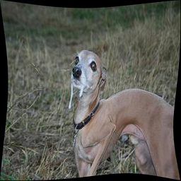
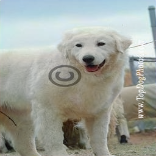
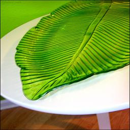

# Reference-Based-Sketch-Image-Colorization-ImageNet

This is a PyTorch implementation of CVPR 2020 paper (Reference-Based Sketch Image Colorization using Augmented-Self Reference and Dense Semantic Correspondence)

We will provide pre-trained model on ImageNet dataset shortly


## 1 Training

### 1.1 Procedure

- Prepare the ImageNet dataset

- Download the PyTorch official pre-trained VGG-16 model, and then rename it to 'vgg16_pretrained.pth'

(torchvision webpage: https://github.com/pytorch/vision/blob/main/torchvision/models/vgg.py)

(download webpage: https://download.pytorch.org/models/vgg16-397923af.pth)

- Change the parameter in yaml file and run

(vgg_name -> your VGG-16 model path)

(baseroot_train -> your ImageNet dataset path)

```bash
sh sbatch_run.sh or sh local_run.sh
```

I use 8 Titan GPUs to train the network with batch size of 64, epoch of 40 (a epoch includes 1281167 training images). It takes approximately 15 days!

The forward of GAN discriminator and VGG-16 take a lot of time, which are used to compute GAN loss and perceptual loss, etc.

### 1.2 Training Snapshots

epoch 1: input grayscale - input reference (transformed from GT) - generated sample - GT


epoch 2: input grayscale - input reference (transformed from GT) - generated sample - GT



epoch 3: input grayscale - input reference (transformed from GT) - generated sample - GT


epoch 4: input grayscale - input reference (transformed from GT) - generated sample - GT


epoch 5: input grayscale - input reference (transformed from GT) - generated sample - GT


epoch 6: input grayscale - input reference (transformed from GT) - generated sample - GT


epoch 7: input grayscale - input reference (transformed from GT) - generated sample - GT



epoch 8: input grayscale - input reference (transformed from GT) - generated sample - GT



epoch 9: input grayscale - input reference (transformed from GT) - generated sample - GT


epoch 10: input grayscale - input reference (transformed from GT) - generated sample - GT


## 2 Validation

- Prepare the references with same names to ImageNet test10k

- Change the parameter in yaml file and run

```bash
sh val_run.sh or sh validation.sh
```
